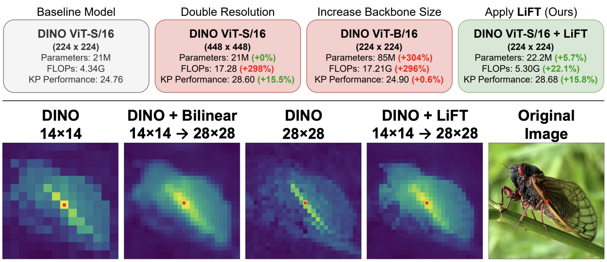

# LiFT: A Lightweight Feature Transform for Dense ViT Descriptors (ECCV 2024)



This is the official code release for [LiFT: A Surprisingly Simple Lightweight Feature Transform for Dense ViT Descriptors](https://arxiv.org/abs/2403.14625) published at ECCV 2024. 

This repository includes code to use pretrained LiFT modules in combination with pretrained ViT backbones as dense feature extractors. In addition, it includes code to train new LiFT modules for your specific ViT backbone. Additional details are provided in the sections below.

This repository included built in support for several DINO(v1) and fully supervised ViT backbones. Additional backbones and pretrained LiFT modules will be made available in future updates.

Also please see our [Project Webpage](https://www.cs.umd.edu/~sakshams/LiFT/).


## Setup

Recommended install instructions:
```
conda create --name lift python=3.12
conda activate lift
pip install -r requirements.txt
```

Details on downloading pretrained LiFT models can be found in the next section.


## Usage

### Using Pretrained LiFT

We have provided several pretrained LiFT modules [here](https://drive.google.com/drive/folders/12Q8n_vur3njOgAO1iu0P6tDIcszrnadd). We recommend downloading these files and placing them in the pretrained/ dir.

Please note that a LiFT module is specific to the feature distribution it was trained on, and cannot be applied to a different backbone, layer, or facet than was originally used without having significantly degraded performance. Please ensure that you select a valid LiFT module for the backbone, layer, and facet used.

You can use lift_extractor.py to help facilitate ViT+LiFT feature extraction for pretrained LiFT modules. Here are several examples of its usage:
```
python lift_extractor.py --image_path assets/sample.jpg --output_path sample.pth --model_type dino_vits16 --lift_path pretrained/lift_dino_vits16.pth
python lift_extractor.py --image_path assets/sample.jpg --output_path sample.pth --model_type dino_vits8 --lift_path pretrained/lift_dino_vits8.pth
python lift_extractor.py --image_path assets/sample.jpg --output_path sample.pth --model_type dino_vitb16 --lift_path pretrained/lift_dino_vitb16.pth
python lift_extractor.py --image_path assets/sample.jpg --output_path sample.pth --model_type dino_vitb8 --lift_path pretrained/lift_dino_vitb8.pth
```

lift_extractor.py also has built-in support to run LiFT iteratively boost feature density further. Please note that apply LiFT iterative increases both compute cost and memory requirements, and, depending on the task, may yeild diminishing returns in performance improvements. We recommend testing multiple iteration numbers to test what feature density is best for your task. Example usage:
```
python lift_extractor.py --image_path assets/sample.jpg --output_path sample.pth --model_type dino_vits16 --lift_path pretrained/lift_dino_vits16.pth --lift_iter 4
python lift_extractor.py --image_path assets/sample.jpg --output_path sample.pth --model_type dino_vits8 --lift_path pretrained/lift_dino_vits8.pth --lift_iter 3
```

### Training LiFT

You can use train_lift.py to train a new LiFT module with one of the built-in extractors, or with your own ViT backbone. Sample usage for built-in extractors:
```
python train_lift.py --dataroot /YOUR/PATH/TO/imagenet/train/ --model_type dino_vits16 --save_every 1 --epochs 5 --lr 0.001 --augment --loss cosine --batch_size 256 --output_dir lift_imagenet_trains
python train_lift.py --dataroot /YOUR/PATH/TO/imagenet/train/ --model_type dino_vits8 --save_every 1 --epochs 5 --lr 0.001 --augment --loss cosine --batch_size 64 --output_dir lift_imagenet_trains
```

To load your own ViT backbone, either modify extractor.py or implement "my_extractor" in train_lift.py to load your model. Please be aware that the current version of LiFT natively supports patch size 8 and 16 for backbones.

### Evaluations and Visualizations

We have included additional scripts to perform evaluations on SPair-71k Keypoint Correspondence, DAVIS Video Object Segmentation, and Unsupervised Object Discovery with TokenCut on several datasets. We have also included eval_visualize_feats.py, which can be used to create feature self-similarity visualizations. Sample commands can be found in the header of each script.


## Acknowledgments

Our LiFT feature extractor is built as an extension to extractor.py from https://github.com/ShirAmir/dino-vit-features.

This repository includes built-in support to load several pretrained ViTs from DINO(v1) (https://github.com/facebookresearch/dino) and TIMM (https://github.com/huggingface/pytorch-image-models).

Our evaluation scripts include code adapted from the following sources: https://github.com/facebookresearch/dino, https://github.com/davisvideochallenge/davis2017-evaluation, https://github.com/valeoai/LOST, https://github.com/YangtaoWANG95/TokenCut, and https://github.com/mwalmer-umd/vit_analysis.


## License

Distributed under the MIT License.


## Citation

If you found LiFT useful, please cite our paper with the following:
```
@inproceedings{suri2025lift,
  title={LiFT: A Surprisingly Simple Lightweight Feature Transform for Dense ViT Descriptors},
  author={Suri, Saksham and Walmer, Matthew and Gupta, Kamal and Shrivastava, Abhinav},
  booktitle={European Conference on Computer Vision},
  pages={110--128},
  year={2025},
  organization={Springer}
}
```
